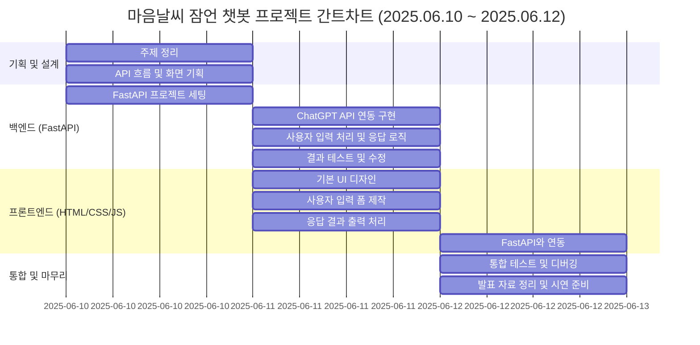

# AI 잠언 챗봇 (Proverb-Recommending AI Chatbot)

### "오늘 기분은 어떠신가요?"
* 당신의 감정을 분석해, 지금 필요한 잠언 말씀을 추천해드립니다.

## 🎯 프로젝트 소개

* 프로젝트 배경: 성경말씀 중 지혜의 말씀이라 불리는 잠언을 통해 사용자들의 기분에 따른 성경말씀과 위로를 건네는 챗봇을 만들고 싶었다.

* 주요 목표: 사용자의 기분을 AI가 분석하여, 상황에 가장 적절한 잠언 말씀을 추천하는 것

## ✨ 챗봇 시연
(1분 내외 시연 영상 링크)


## 🚀 기능 및 특징
* 지능적인 감정 분석(AI의 통찰력)
-> "오늘 힘들었어" 같은 문장도 키워드로 인식하는게 아니라, AI가 문맥을 파악해서 '슬픔' 같은 핵심 감정을 분류해 낸다.

* 목적에 맞는 맞춤형 추천(기획자의 의도)
-> 미리 준비된 5가지 잠언 말씀 중 하나를 연결하여 주제에서 벗어나지 않고, 프로젝트의 핵심 목표인 '잠언 추천'을 안정적으로 수행할 수 있다.

* 완전한 개인화 경험(사용자 중심 설계)
-> JWT 기반의 인증 시스템을 통해 모든 대화기록이 사용자별로 따로 저장되고, '기록 보기'를 통해 언제든 자신의 이전 대화를 확인할 수 있다.

## 🛠️ 사용된 기술 스택

* FastAPI/HTML/CSS/JS

## ⚙️ 설치 및 실행 방법

### 1. 프로젝트 복제 (Clone)
```
git clone https://github.com/GH-57/First_Project.git
```

### 2. 백엔드 설정

### a. 가상환경 생성 및 활성화
```
# 가상환경 생성
python -m venv .venv

# 가상환경 활성화 (Windows)
.\.venv\Scripts\activate

# 가상환경 활성화 (macOS/Linux)
source .venv/bin/activate
```

### b. 필요 라이브러리 설치 
```
pip install "fastapi[all]" "passlib[bcrypt]" "python-jose[cryptography]" openai requests

# fastapi[all]: FastAPI 웹 프레임워크과 실행에 필요한 Uvicorn, Pydantic을 포함하는 묶음 라이브러리
# passlib[bcrypt]: 비밀번호 해싱을 위한 라이브러리
# python-jose[crytography]: JWT 토큰 생성 및 검증을 위한 라이브러리
* openai: OpenAI API를 사용하기 위한 공식 라이브러리
# requests: 프록시 서버와 직접 통신하기 위한 HTTP 요청 라이브러리
```

### c. OpenAI API 키 설정 (환경변수)
* [중요!] 이 프로젝트는 부트캠프에서 제공하는 프록시 서버 (https://dev.wenivops.co.kr/services/openai-api) 를 통해 OpenAI API를 호출한다
* 제공받은 프로시 서버용 API키를 아래와 같이 환경 변수로 설정한다.
```
# Windows (CMD)
set OPENAI_API_KEY="pk-xxxxxxxxxxxxxxxxxxxxxxxxxxxxxx"

# Windows (PowerShell)
$env:OPENAI_API_KEY="pk-xxxxxxxxxxxxxxxxxxxxxxxxxxxxxx"

# macOS/Linux
export OPENAI_API_KEY="pk-xxxxxxxxxxxxxxxxxxxxxxxxxxxxxx"
```
### d. 백엔드 서버 실행
```
uvicorn main:app --reload # 백엔드 파일명이 main.py일 때
```
* 서버는 http://127.0.0.1:8000에서 실행된다.

### 3. 프론트엔드 실행
* `frontend` 폴더로 이동한 후, `index.html`을 브라우저에서 열거나 VSCode Live Server 확장으로 실행합니다.

---
## 📖 API 문서
* 백엔드 서버 실행 후, http://127.0.0.1:8000/docs 로 접속하면 모든 API 엔드포인트를 확인하고 직접 테스트 할 수 있는 SwaggerUI가 제공된다.

### 1. 회원가입
* Endpoint: ```POST```/register
* 설명: 새로운 사용자를 생성한다.
* 요청 본문 (Request Body):
```
{
  "email": "test@naver.com",
  "password": "1234",
  "nickname": "테스트"
}
```
* 성공 응답 (200 OK):
```
{
  "message": "테스트님, 회원가입이 완료되었습니다."
}
```
---
### 2. 로그인
* Endpoint: ```POST```/login
* 설명: 로그인하여 JWT인증 토큰을 발급받는다.
* 요청 본문 (Request Body):
    * username: "test@naver.com"
    * password: "1234"
* 성공 응답 (200 OK):
```
{
  "access_token": "eyJhbGciOiJIUzI1Ni...",
  "token_type": "bearer",
  "nickname": "테스트"
}
```
---
### 3. 채팅
* Endpoint: ```POST```/chat
* 인증: ```Bearer``` 토큰 필요
* 설명: 사용자의 메시지를 받아 감정을 분석하고, 맞는 잠언을 추천하며, 대화내용을 저장한다.
* 요청 본문 (Request Body):
```
{
  "prompt": "오늘 하루 정말 힘들었어"
}
```
* 성공 응답 (200 OK):
```
{
  "verse": "잠언 14:13",
  "content": "웃을 때에도 마음에 슬픔이 있고 즐거움의 끝에도 근심이 있느니라",
  "comment": "슬픈 일이 있으시군요.. 슬픔 가운데 에서도 다시 회복되기를 기도합니다."
}
```
---
### 4. 대화 기록 조회
* Endpoint: ```GET```/history
* 인증: ```Bearer``` 토큰 필요
* 설명: 현재 로그인 된 사용자의 모든 대화 기록을 조회한다.
* 성공 응답 (200 OK):
```
[
  {
    "prompt": "오늘 하루 정말 힘들었어",
    "response": {
      "verse": "잠언 14:13",
      "content": "웃을 때에도 마음에 슬픔이 있고 즐거움의 끝에도 근심이 있느니라",
      "comment": "슬픈 일이 있으시군요.. 슬픔 가운데 에서도 다시 회복되기를 기도합니다."
    },
    "timestamp": "2025-06-12T12:34:56.789Z"
  }
]
```

## 🗓️ 개발 과정

### WBS

---
### 와이어프레임


## 📝 회고
### 여러 시행착오들: 
* ChatGPT API를 연동하고 API테스트 진행과정에서 여러 인증 및 경로 에러(429, 404 등)를 마주했고, requests 라이브러리로 직접 요청을 보내는 디버깅을 통해 해결 할 수 있었다. 
=>최종적으로 도달한 것은 AI가 사용자의 문장을 
'기쁨', '슬픔', '무기력함', '분노', '불안' 5가지 감정으로 분석하고, 그결과에 따른 잠언 말씀구절과 코멘트를 출력했다.

* UI/UX 디자인 부분 CSS/JS가 막막했다.
-> AI의 도움을 받아 레이아웃을 구성하고, 이후 사용자 경험을 개선하기 위해 스크롤 문제, 버튼 디자인 등 세부적인 부분을 수접하며 완성도를 높였다.

* 대부분의 코드들을  AI에 물어물어 짜보았고, 왜 이렇게 코드를 짰는지, 특히 백엔드 코드의 흐름을 파악하려 했다.

### 좋았던 점
* 본 프로젝트 목표인 풀스택 경험과, 비동기 통신 다루기, 인공지능 API로 다뤄보는 경험등을 쌓을 수 있는 시간이어서 좋았다.

### 아쉬웠던 점
* 처음 자율주제를 정하는것 부터 나에게는 쉽지않았다. (틀 안에 박힌 생각) 그렇다고 겹치지도 않았으면 하는 욕심에 이 주제를 선정했다. 

* 감정을 5가지(기쁨, 슬픔, 분노, 무기력함, 불안)으로 고정했다보니, 복합적인 감정이나, 아무렇게나 막 친 입력에 대해서는 적절한 답변이 나오지 않았다.
-> 뭔가 좀 더 개선 할 수도 있겠다는 생각이 들었다.

* AI를 통해 짠 코드들의 흐름이 아직 완벽하게는 이해가 되지 않는 모습이다.
-> "이건 왜 이렇죠?" 라고 물어보시면 얼버무리다가 끝날듯 해 보인다.

* 로그인/회원가입 화면에서 '이메일 인증' 이나, '비밀번호 찾기'등의 시스템 미구현
-> 이 또한 부가적으로 도전 해볼만한 부분이라는 생각이 들었다.

* 로그인 시 '환영합니다 {nickname} 님' 같은 사용자 평의성 문구 미구현
-> 사소한 부분 이지만 '있었으면 좋았겠다' 하는 생각이 들었다 