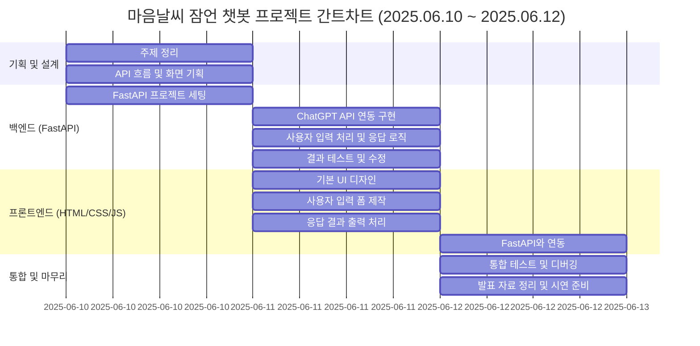

# AI 잠언 챗봇 (Proverb-Recommending AI Chatbot)

### "오늘 기분은 어떠신가요?"
* ChatGPT 서버 API를 연동하여 오늘의 기분을 분석하여 잠언 말씀을 추천함

## 1. 소개 및 목표

### 프로젝트 이름
* AI 잠언 챗봇

### 목표
* AI 잠언 챗봇은 사용자의 기분을 분석하여 잠언 말씀을 추천하는 것

## 2. 프로젝트 개요

### 프로젝트 배경
* 성경말씀 중 지혜의 말씀이라 불리는 잠언을 통해 사용자들의 기분에 따른 성경말씀을 추천해주고 싶었음

### 주요 기능
* 사용자와의 대화를 통해 기분을 분석하여 잠언 말씀 추천

## 3. 챗봇 시연

(링크)

## 4. 기술 스택

### FastAPI/HTML/CSS/JS

## 5. 기능 및 특징

### 주요 기능
* 사용자의 감정 분석하여 5가지 기준(기쁨, 슬픔, 분노, 무기력함, 불안)에 따른 잠언말씀 출력&코멘트 

### 특징 
* 지능적인 감정 분석(AI의 통찰력)
-> "오늘 힘들었어" 같은 문장도 키워드로 인식하는게 아니라, AI가 문맥을 파악해서 '슬픔' 같은 핵심 감정을 분류해 낸다.

* 목적에 맞는 맞춤형 추천(기획자의 의도)
-> 미리 준비된 5가지 잠언 말씀 중 하나를 연결하여 주제에서 벗어나지 않고, 프로젝트의 핵심 목표인 '잠언 추천'을 안정적으로 수행할 수 있다.

* 완전한 개인화 경험(사용자 중심 설계)
-> 회원가입/로그인 시스템을 통해 모든 대화기록이 사용자별로 따로 저장된다.

## 6. 개발 과정

### WBS

---
### 와이어프레임

## 7. 개발하면서 느낀 점
### 여러 시행착오들: 
* ChatGPT API를 활용하여 API테스트 진행하는데 자꾸만 에러가 떠서 AI가 추천하는 코드대로 여러번 디버깅을 시도했다.
=> 그리하여 도달한 것은 AI가 사용자의 문장을 
'기쁨', '슬픔', '무기력함', '분노', '불안' 5가지 감정으로 분석하고, 그결과에 따른 잠언 말씀구절과 코멘트를 출력했다.

* UI/UX 디자인 부분 CSS/JS가 막막했다.
-> 이 또한 AI 추천 코드대로 사용했다

### 좋았던 점
* 본 프로젝트 목표인 풀스택 경험과, 비동기 통신 다루기, 인공지능 API로 다뤄보는 경험등을 쌓을 수 있는 시간이어서 좋았다

### 아쉬웠던 점
* 처음 자율주제를 정하는것 부터 나에게는 쉽지않았다. (틀안에 박힌 생각)
* 감정을 5가지(기쁨, 슬픔, 분노, 무기력함, 불안)으로 고정했다보니, 복합적인 감정이나, 아무렇게나 막 친 입력에 대해서는 적절한 답변이 나오지 않았다.
-> 뭔가 좀 더 개선 할 수도 있겠다는 생각이 들었다.
* AI를 통해 짠 코드들의 흐름이 완벽하게는 이해가 되지 않는 모습이다.
-> "이건 왜 이렇죠?" 라고 물어보시면 얼버무리다가 끝날듯해 보인다.