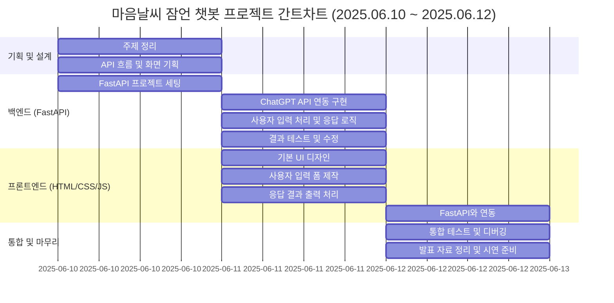

# First_Project

---
## WBS

```mermaid
gantt
    title 마음날씨 잠언 챗봇 프로젝트 간트차트 (2025.06.10 ~ 2025.06.12)
    dateFormat  YYYY-MM-DD
    excludes    weekends

    section 기획 및 설계
    주제 정리        :   2025-06-10, 0.5d
    API 흐름 및 화면 기획        :   2025-06-10, 0.5d

    section 백엔드 (FastAPI)
    FastAPI 프로젝트 세팅        :2025-06-10, 0.5d
    ChatGPT API 연동 구현        :        2025-06-11, 0.5d
    사용자 입력 처리 및 응답 로직:        2025-06-11, 0.5d
    결과 테스트 및 수정          :        2025-06-11, 0.5d

    section 프론트엔드 (HTML/CSS/JS)
    기본 UI 디자인               :        2025-06-11, 0.5d
    사용자 입력 폼 제작          :        2025-06-11, 0.5d
    응답 결과 출력 처리          :        2025-06-11, 0.5d
    FastAPI와 연동               :        2025-06-12, 0.5d

    section 통합 및 마무리
    통합 테스트 및 디버깅        :        2025-06-12, 0.5d
    발표 자료 정리 및 시연 준비  :        2025-06-12, 0.5d

```
---
## 와이어프레임
