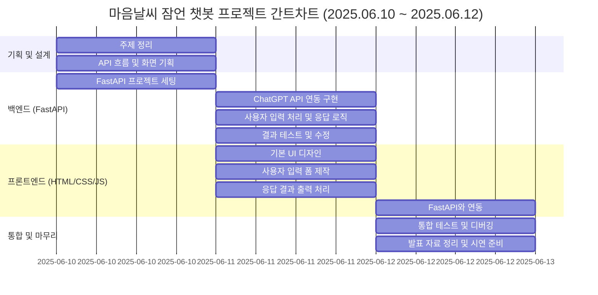

# AI 잠언 챗봇 (Proverb-Recommending AI Chatbot)

### "오늘 기분은 어떠신가요?"
* ChatGPT 서버 API를 연동하여 오늘의 기분을 분석하여 잠언 말씀을 추천함

## 1. 소개 및 목표

### 프로젝트 이름
* AI 잠언 챗봇

### 목표
* AI 잠언 챗봇은 사용자의 기분을 분석하여 잠언 말씀을 추천하는 것

## 2. 프로젝트 개요

### 프로젝트 배경
* 성경말씀 중 지혜의 말씀이라 불리는 잠언을 통해 사용자들의 기분에 따른 성경말씀을 추천해주고 싶었음

### 주요 기능
* 사용자와의 대화를 통해 기분을 분석하여 잠언 말씀 추천

## 3. 챗봇 시연

(링크)

## 4. 기술 스택

### FastAPI/HTML/CSS/JS

## 5. 기능 및 특징

### 주요 기능
* 사용자의 감정 분석하여 5가지 기준(기쁨, 슬픔, 분노, 무기력함, 불안)에 따른 잠언말씀 출력&코멘트 

---
## WBS

---
## 와이어프레임
